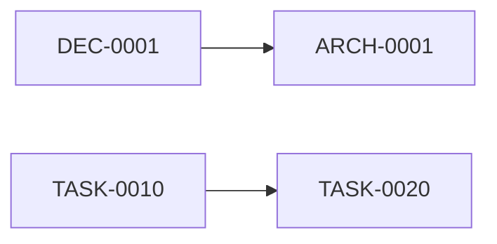

# Documentation Guide

This guide defines the conventions for documentation under `docs/`.

Documents are plain Markdown files with optional YAML Front Matter. vibe-doc renders, inspects, and lints them. They remain readable and editable with GitHub, text editors, and AI tools without vibe-doc.

This README is an operational guide, not a Decision, Task, or Architecture record, and requires no Front Matter.

## Directory structure

```text
docs/
├── README.md
├── architecture/
├── decisions/
│   ├── architecture/
│   ├── product/
│   ├── domain/
│   └── operations/
└── tasks/
    ├── todo/
    ├── in-progress/
    ├── done/
    └── wont-do/
```

### Architecture

`architecture/` describes the current system structure and behavior. It explains how the system works now. A change to that structure may be supported by one or more Decisions.

### Decisions

Decision is the general record type for choices that should remain understandable in the future. An Architecture Decision Record (ADR) is an architecture Decision, not a separate document type.

| Directory | `decision_type` | Use |
| --- | --- | --- |
| `decisions/architecture/` | `architecture` | System structure, technology, security, and ADRs |
| `decisions/product/` | `product` | Product scope, features, and intended users |
| `decisions/domain/` | `domain` | Business rules, terminology, and domain models |
| `decisions/operations/` | `operations` | Development process, maintenance, and operations |

Use `accepted` for an active Decision. Other statuses may be used when needed, but vibe-doc does not enforce a strict Decision lifecycle.

Recommended sections are:

```markdown
# Decision title

## Context

## Decision

## Consequences
```

These sections are conventions, not lint requirements.

### Tasks

Task status is represented by both its directory and its Front Matter `status`.

| Directory | `status` | Meaning |
| --- | --- | --- |
| `tasks/todo/` | `todo` | Not started or waiting to be selected |
| `tasks/in-progress/` | `in-progress` | Currently being worked on |
| `tasks/done/` | `done` | Completed |
| `tasks/wont-do/` | `wont-do` | Closed without implementation |

Move the Markdown file when its status changes and update `status` at the same time.

For a `wont-do` Task, write the reason in the Task when it is specific to that work. Create a separate Decision when the reason establishes a reusable architecture, product, domain, or operations policy. Linking a `wont-do` Task to a Decision is useful but not mandatory.

## Front Matter

A typical document starts with:

```yaml
---
vibedoc: 1
id: TASK-0030
kind: task
status: todo
tags:
  - cli
  - rust
related:
  - ARCH-0004
depends_on:
  - TASK-0010
---
```

The standard fields are:

| Field | Meaning |
| --- | --- |
| `vibedoc` | Schema version; currently `1` |
| `id` | Unique document ID |
| `kind` | `architecture`, `decision`, or `task` |
| `status` | Status appropriate for the document kind |
| `tags` | Tags used for navigation and filtering |
| `related` | IDs of related documents |
| `depends_on` | IDs of Tasks that must precede this Task |

Additional metadata such as dates or priority is allowed. Unknown fields are not lint errors.

## IDs and filenames

Decision IDは `DEC-` に4桁、Task IDは `TASK-` に4桁、Architecture IDは `ARCH-` に4桁を続ける。

Use lowercase kebab-case after the numeric filename prefix:

```text
decisions/architecture/0007-mermaid-from-cdn.md
tasks/todo/0030-cli.md
architecture/003-web-ui.md
```

Get the next Decision or Task number with:

```bash
vibe-doc next-index decision
vibe-doc next-index task
```

Decision numbers increase by 1. Task numbers increase by 10. The command only prints a candidate number; it does not create a file. Concurrent branches may choose the same number, so run lint after merging.

## Related documents and backlinks

Use `related` for a general, symmetric connection:

```yaml
related:
  - DEC-0007
```

Write it on one side only. vibe-doc automatically shows the connection on both documents.

Use `depends_on` only for directional Task dependencies:

```yaml
depends_on:
  - TASK-0010
```

The source Task shows TASK-0010 as a dependency. TASK-0010 automatically shows the source Task as a dependent Task.

Normal Markdown links to managed documents are also indexed. The target document automatically shows the source under its references. Do not manually store backlinks or duplicate reverse relationships.

## Tags

Tags are shared across Architecture, Decision, and Task documents. Prefer lowercase kebab-case names such as `next-js`, `web-ui`, and `error-handling`.

The Web UI provides:

- `/tags` for all tags and document counts.
- `/tag/next-js` for all documents tagged `next-js`.
- Clickable tags in document lists and details.

List all unique tags from the CLI with:

```bash
vibe-doc tag
```

The command prints one tag per line in sorted order.

## Mermaid diagrams

Use a fenced `mermaid` code block:

````markdown

````

The Web UI renders the block as SVG with a pinned Mermaid version embedded in the `vibe-doc`
binary. Mermaid is loaded lazily only when a document contains a diagram, so diagrams work without
an internet connection. The diagram follows the Web UI's light or dark theme and is redrawn when the
theme changes. If Mermaid cannot be loaded or the diagram is invalid, vibe-doc keeps the source code
visible and shows a small error instead of breaking the page.

## Lint policy

Lint is intentionally lightweight. Run:

```bash
vibe-doc lint
```

It checks clear structural problems such as:

- Invalid YAML Front Matter.
- Duplicate document IDs.
- Missing `related` or `depends_on` targets.
- Broken Markdown links to managed documents.
- A Task directory that does not match its `status`.

It does not require:

- A reason for every `wont-do` Task.
- A Decision link for every Task.
- Manually written backlinks.
- Fixed body sections for each document kind.
- A predefined tag vocabulary.

Lint should help find mistakes without making documentation expensive to maintain.

## Recommended workflow

This workflow is mandatory for AI agents.
AI agents should run `vibe-doc lint` at appropriate checkpoints and address any reported issues before proceeding.

1. Choose the correct document kind and directory.
2. For a Decision or Task, get the next candidate number. `vibe-doc next-index decision` or `vibe-doc next-index task`.
3. Add only useful tags and relationships.
4. Move Tasks between status directories as work progresses.
