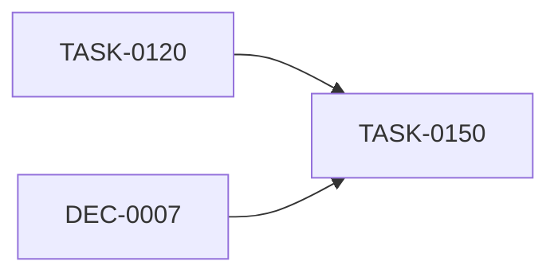

# Web UI

## 画面

| 画面 | 内容 |
| --- | --- |
| Dashboard | 文書数、種別・状態ごとの件数、最近更新された文書、lint概要。 |
| Documents | 全文書の検索と、種別・状態・タグによる絞り込み。 |
| Decisions | Decisionの種別、状態、タグによる一覧。 |
| Tasks | `todo`、`in-progress`、`done`、`wont-do`で絞り込める一覧。 |
| Document Detail | Markdown本文、メタデータ、関連文書、Taskの依存関係、本文リンク、逆引き。 |
| Tags | `/tags`でタグ名と文書数を一覧表示。 |
| Tag Detail | `/tag/{tag}`で該当する全種別の文書を表示。 |
| Links | 関連文書、Taskの依存関係、本文リンクと逆引きの一覧。 |
| Lint | 最新の診断結果を重要度別に表示。 |

Front MatterはYAMLのまま本文へ表示せず、ID、kind、status、tags、追加メタデータをヘッダーやサイド情報として整形する。

## 検索

ID、タイトル、タグ、本文に対する、大文字・小文字を区別しない部分一致とする。検索には起動時に構築したメモリ上のインデックスを使う。サイドバーのReloadを押すと、文書ルートを再走査してインデックスとlint結果を更新し、現在の画面を再取得する。

## タグ

タグは文書種別をまたいで集計する。`/tags`の一覧、文書一覧、文書詳細に表示されるタグはクリック可能にする。

タグを選択すると`/tag/{tag}`へ移動する。例えば`next-js`は`/tag/next-js`とする。タグ値にURL上で特別な意味を持つ文字があれば、パス部分をURLエンコードする。

タグ名は小文字のkebab-caseを推奨するが、lintでは強制しない。

## Mermaid

Markdown本文の`mermaid`コードブロックを図として描画する。

````markdown

````

Markdownレンダリング後に`language-mermaid`のコードブロックを検出し、フロントエンドへ
依存関係として組み込んだMermaidでSVGへ変換する。MermaidはViteの動的importで別チャンク
に分割し、図を含む文書でだけ遅延読み込みする。生成されたチャンクは他のWeb UIアセットと
同様にRustバイナリへ埋め込む。

- 実装時に特定のMermaidバージョンへ固定する。
- `securityLevel: strict`で初期化する。
- Web UIのテーマがダークなら`dark`、ライトなら`default`テーマで描画する。
- Web UIのテーマを切り替えた場合は、表示中の図を新しいテーマで再描画する。
- Mermaidソース内のリテラルな`\n`は、描画直前に`<br/>`へ変換して改行表示する。
- Mermaidモジュールを読み込めない場合は元のコードブロックを表示する。
- Mermaidの構文解析に失敗してもページ全体を壊さず、コードと簡潔なエラーを表示する。

## API

```text
GET /api/documents
GET /api/documents/{id}
GET /api/tags
GET /api/tags/{tag}
GET /api/links
GET /api/lint
GET /api/next-index/{kind}
POST /api/reload
```

## 配信

Cargoビルド時にViteでWeb UIをビルドし、`frontend/dist`以下の成果物をRustの
`include_bytes!`でバイナリへ埋め込む。本番の`vibe-doc serve`は埋め込みアセットと
JSON APIを同じAxumサーバーから配信するため、実行時にNode.js、外部の静的ファイル、
CDNへの接続を必要としない。実ファイルに一致しないUIのパスは、クライアント側
ルーティングのため埋め込み`index.html`へフォールバックする。
