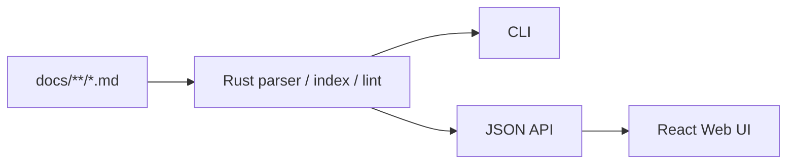

# システム概要

## 概要

vibe-docは、Git管理されたMarkdownドキュメントを、人間が見やすく確認・横断参照するためのローカルツールである。

Decision、ADR、Task、Architecture文書を対象とし、Markdownを正本として維持する。vibe-docは読み取り、可視化、軽い検査を担い、文書の作成や編集はAI、テキストエディタ、GitHubなどに任せる。

## 目的

- Markdown文書をブラウザで読みやすく表示する。
- 種類、状態、タグ、関連文書から目的の文書を探せるようにする。
- `related`、Taskの依存関係、本文リンクから逆引きを表示する。
- Web UIとCLIの両方からタグ一覧を取得できるようにする。
- よくある構造上のミスだけを、緩いlintで知らせる。
- DecisionとTaskの次の採番候補を返す。
- Rustの単一バイナリとして配布する。

## 非目標

- NotionやJiraの代替となる編集・共同作業アプリは作らない。
- Web UIからMarkdownを編集、状態変更、ファイル移動しない。
- SQLiteなどのデータベースや永続インデックスを持たない。
- 厳格なスキーマや、すべてのリンク・関係の完全性を強制しない。
- プロジェクト固有のテンプレートや業務ルールを組み込まない。

## 全体構成

```text
Markdown + YAML Front Matter
        ↓
Rustが解析してメモリ上のDocument Indexを構築
        ↓
CLI / JSON API / React Web UI
```

JSONはAPIの応答形式として使う。XML、データベース、独自バイナリ形式を正本にはしない。



## 技術構成

- Backend: Rust、Axum、Serde、YAML parser、Markdown parser。
- Frontend: React、TypeScript、Vite。
- Index: 起動時に構築するメモリ上のインデックス。
- 配布: Viteの静的アセットをRustバイナリへ埋め込む。
- 開発: Vite開発サーバーからRustの`/api`へプロキシする。
- 本番: `vibe-doc serve`の単一プロセスでUIとAPIを提供する。

## 実装順

1. `./docs`配下のMarkdownとFront Matterの走査・解析、Document共通モデル。
2. ID、タグ、`related`、`depends_on`、Markdownリンク、逆引きのメモリ上インデックス。
3. `lint`、`tag`、`next-index`。
4. 読み取りAPIとDocuments、Document Detail、Tags、Tag Detail、LintのWeb UI。
5. Markdown表示とCDN版Mermaidの描画・フォールバック。
6. Decisions、Tasks、Links、Dashboardの専用一覧。

## 受け入れ条件

- `./docs`があるディレクトリで`vibe-doc serve`を起動すると、ブラウザで全Markdown文書を閲覧できる。
- Decisionの種別とTaskの状態をUIで区別できる。
- タグ一覧、関連文書、依存関係、本文リンクの逆引きを利用できる。
- Mermaid、lint、tag、next-indexが各仕様どおり動作する。
- Markdownの作成・更新をWeb UIに依存しない。
